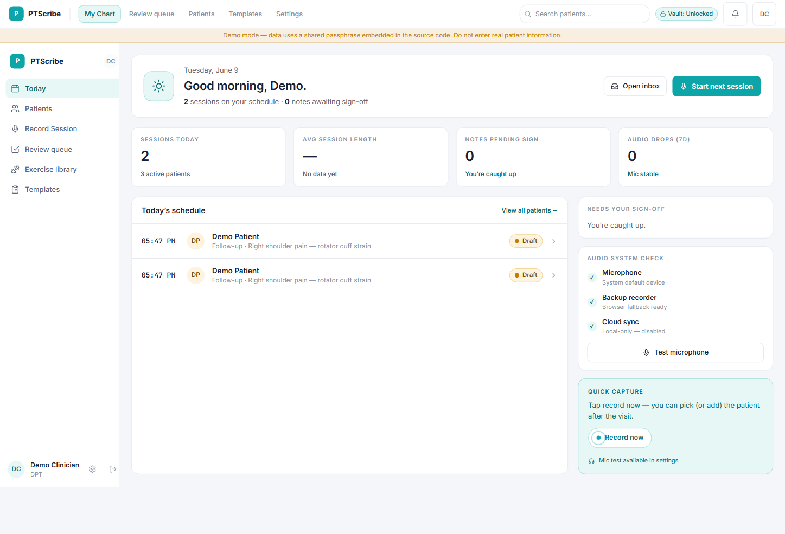
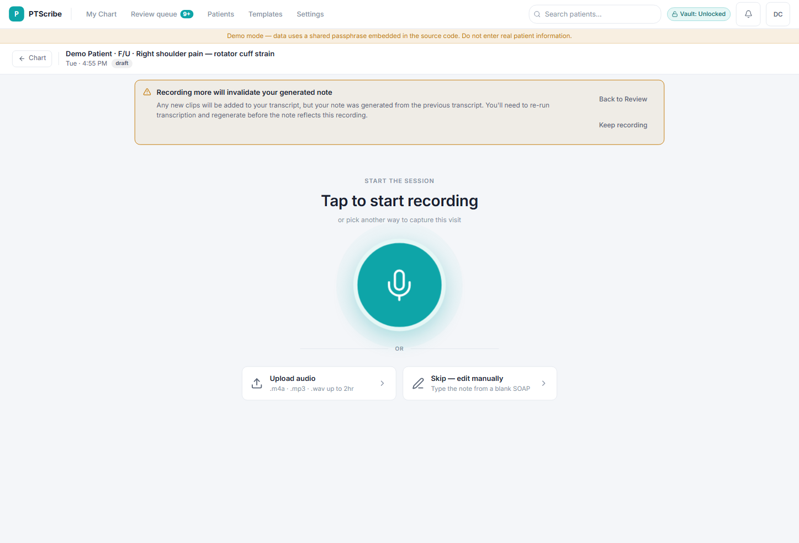
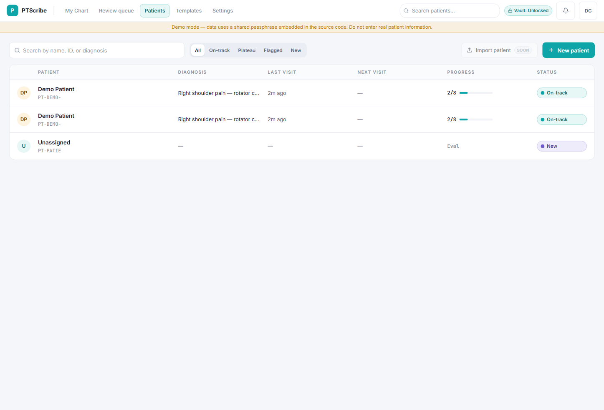
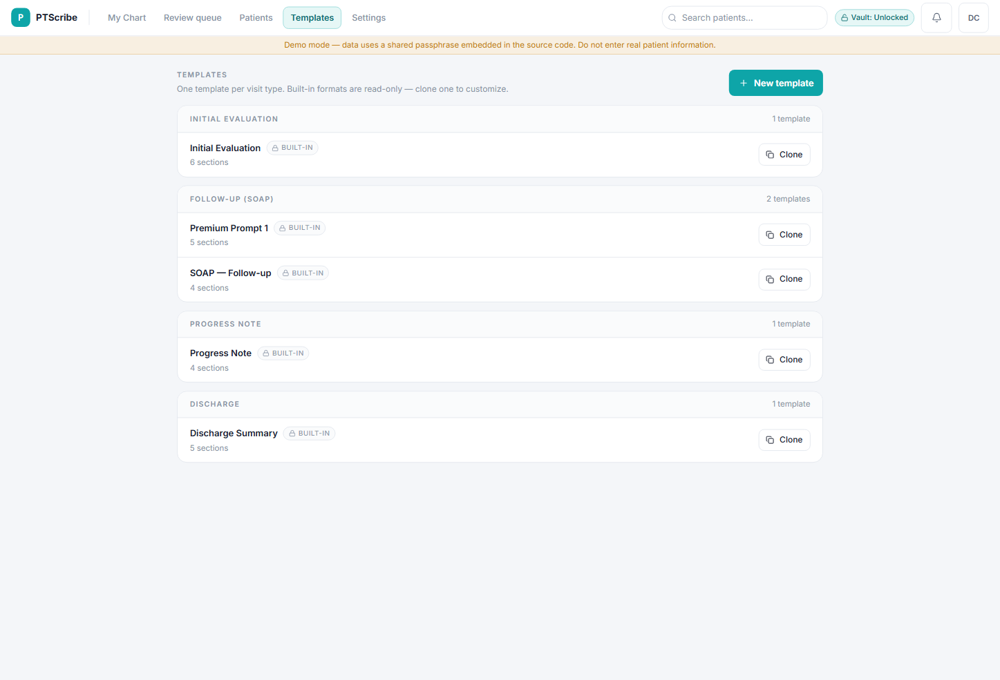

# PTScribe

> A clinical scribe for physical therapists — record the visit, get a structured note. 100% local-first. No accounts. No backend.


**[Live demo →](https://ptscribe.kgiacchi.workers.dev/)**

---

## What it does

PTs spend 2–3 hours a day on documentation. The leading SaaS scribes charge $1,500–$2,000/yr and store your session data on their servers. PTScribe is the open-source alternative: record the visit, get a structured SOAP note, copy it into your EMR. The AI runs through a thin proxy that stores nothing — all recordings and notes stay encrypted on your device.

---

## Screenshots

**My Chart** — daily schedule, pending sign-offs, and audio system status at a glance



**Session** — tap to record, upload audio, or skip to a manual note



**Patients** — roster with diagnosis, visit history, progress, and status tracking



**Templates** — built-in note formats by visit type; clone any to customize



---

## How it works

| Step                   | Action                                             |
| ---------------------- | -------------------------------------------------- |
| 1. **Start a session** | Select a patient and visit type                    |
| 2. **Record**          | Capture audio during the visit or dictate after    |
| 3. **Transcribe**      | Whisper converts audio to text with speaker labels |
| 4. **Generate**        | Claude produces a structured SOAP-style note       |
| 5. **Finalize**        | Review, edit, and copy into your EMR               |

---

## Features

- **Patient roster** — track patients, diagnoses, and plans of care
- **Session history** — every visit's audio, transcript, and generated note in one place
- **Customizable templates** — adapt note structure to your clinic's format
- **Exercise library** — per-patient exercise plans you can pull into any note
- **Two transcription paths** — cloud (Deepgram Nova via Cloudflare Workers AI, with speaker diarization) or fully on-device (Whisper, no data leaves the browser)
- **At-rest encryption** — AES-GCM vault, passphrase-protected, tab-lifetime only
- **Offline-capable** — all data in `localStorage` and IndexedDB; works without a connection
- **Mobile-responsive** — usable on a phone or tablet between visits

---

## Stack

| Layer           | Technology                                                         |
| --------------- | ------------------------------------------------------------------ |
| Frontend        | React 19, TypeScript, Vite, Tailwind CSS 4                         |
| Components      | shadcn/ui (Radix primitives)                                       |
| Routing         | React Router 7                                                     |
| Validation      | Zod 4                                                              |
| AI proxy        | Cloudflare Worker — provider credentials never reach the browser   |
| Transcription   | Deepgram Nova-3 (cloud) · Whisper tiny (on-device, via Web Worker) |
| Note generation | Claude (Anthropic) via `/api/generate`                             |
| Auth            | BetterAuth — passkey + magic link, served by the Worker            |
| Storage         | localStorage (app data) · IndexedDB (audio + model cache)          |
| Encryption      | AES-GCM via Web Crypto API                                         |
| Testing         | Vitest · Playwright                                                |

---

## Getting started

Local dev requires two processes running at the same time.

**Terminal 1 — Cloudflare Worker (port 8787)**

```bash
npx wrangler dev
```

**Terminal 2 — Vite frontend (port 8080)**

```bash
npm install
npm run dev
```

Vite proxies all `/api/*` requests to `http://127.0.0.1:8787`, so both must be running for transcription and note generation to work.

### First run: Whisper model download

On first visit to a session the app downloads the Whisper ONNX model (~150 MB) and caches it in IndexedDB. The "Start Recording" button is disabled until the model is ready.

**To skip this on future setups**, seed R2 once after `wrangler dev` is running:

```bash
npx tsx scripts/seed-r2-models.ts
```

---

## Scripts

```bash
npm run dev              # Dev server on port 8080
npm run build            # Production build
npm run build:dev        # Dev-mode build (no minification)
npm run typecheck        # tsc --noEmit
npm run test             # Vitest unit tests
npm run test:e2e         # Playwright E2E tests
npm run lint             # ESLint
npm run format           # Prettier write
```

---

## Project structure

```
ptscribe/
├── src/
│   ├── components/      # UI components (shadcn/ui + domain-specific)
│   ├── contexts/        # Slice providers — AppData, Audio, Session
│   ├── lib/             # Vault, audio recorder, whisper worker
│   ├── pages/           # Route-level pages (Landing, Session, Patients, …)
│   └── services/        # AI clients, data repository, schema, migrations
├── worker/              # Cloudflare Worker — AI proxy, auth, org management
├── scripts/             # One-off tooling (R2 seeding, etc.)
└── docs/                # Architecture, invariants, ADRs
```

---

## Architecture

PTScribe is a local-first single-page app backed by a stateless Cloudflare Worker proxy. The Worker handles AI calls and auth — it never stores or logs clinical data. All session content lives in the browser.

Key invariants:

- **Single write path** — all mutations flow through slice provider mutators → `DataRepository.save()`
- **Encryption at the repository boundary** — `DataRepository` and `AudioRepository` round-trip every byte through AES-GCM when the vault is unlocked
- **AI calls are proxied** — Whisper and Anthropic are reached via `POST /api/transcribe` and `POST /api/generate`; provider credentials are server-side secrets the browser never sees

See [`docs/architecture.md`](docs/architecture.md) and [`docs/invariants.md`](docs/invariants.md) for the full reference.

---

## Privacy

All patient data is stored locally in your browser. Audio and session notes never leave your device except through the AI proxy calls (transcription and note generation). No analytics, no telemetry, no backend database.

PHI never touches a server. The Cloudflare Worker is a proxy only.

**PTScribe is not HIPAA-certified.** AI calls are routed through Cloudflare (transcription) and Anthropic (note generation). Before using real patient data, you are responsible for obtaining a BAA with each provider under your own account.

---

## License

[PolyForm Noncommercial 1.0.0](LICENSE) — free for personal, educational, research, and non-commercial use.
